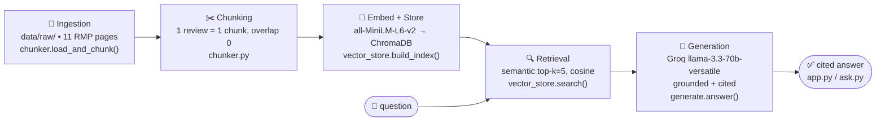

# The Unofficial Guide 🐻

A Retrieval-Augmented Generation (RAG) system that makes **student-generated knowledge about UC Berkeley
CS/EECS professors searchable and answerable**. Ask a plain-language question — *"Which professor should I
take for CS61A?"* — and get a grounded, **cited** answer drawn from real student reviews, never from the
model's general knowledge.

> Berkeley CS students rely heavily on word-of-mouth to decide *who* to take for a course — the same class
> can be a great experience or a demoralizing one depending entirely on the instructor. The official catalog
> tells you a course *exists*; it never tells you a professor "made the final unreasonably hard and refused
> to release the distribution," or that one instructor is "the GOAT" while another teaching the same course
> number is "not prepared for teaching at all." That signal only lives in scattered student reviews. This
> system aggregates it and answers questions with citations.

---

## Quickstart

```bash
python -m venv .venv && source .venv/bin/activate
pip install -r requirements.txt
cp .env.example .env            # add your free Groq key from console.groq.com

python vector_store.py          # build the ChromaDB index (embeds 55 chunks)
python app.py                   # Gradio UI at http://localhost:7860
# or:
python ask.py "Which professor should I take for CS61A?"   # CLI
```

## Architecture



| Stage | File | Tool |
|---|---|---|
| Ingestion + chunking | `chunker.py` | stdlib (regex parsing + cleaning) |
| Embedding + vector store | `vector_store.py` | `sentence-transformers` (`all-MiniLM-L6-v2`) + ChromaDB |
| Retrieval | `vector_store.py::search` | ChromaDB cosine search, top-k=5 |
| Grounded generation | `generate.py::answer` | Groq `llama-3.3-70b-versatile` |
| Interface | `app.py` (Gradio), `ask.py` (CLI) | Gradio |
| Evaluation | `evaluate.py` | — |

---

## 1. Domain & Document Sources

**Domain:** student reviews of UC Berkeley Computer Science / EECS professors and courses.
**Source:** [Rate My Professors](https://www.ratemyprofessors.com) (public student reviews).

**11 documents**, each a professor's page, chosen for **contrast** across the full rating spectrum and 11
courses (CS10, CS61A, CS61B, CS164, CS170, CS182, CS184, CS188, CS189, DATA8, DATA144). Full manifest with
collection notes/caveats: [`data/sources.md`](data/sources.md); raw text in [`data/raw/`](data/raw/).

| Professor | Courses | Overall | URL |
|---|---|---|---|
| Peyrin Kao | CS61B, CS161, CS188 | 4.9/5 | https://www.ratemyprofessors.com/professor/2804069 |
| Daniel Klein | CS188 | 4.7/5 | https://www.ratemyprofessors.com/professor/814582 |
| Jonathan Shewchuk | CS61B, CS189, CS274 | 4.7/5 | https://www.ratemyprofessors.com/professor/246561 |
| John Wright | CS170 | 4.6/5 | https://www.ratemyprofessors.com/professor/2903387 |
| John DeNero | CS61A, DATA8 | 4.4/5 | https://www.ratemyprofessors.com/professor/1621181 |
| Pamela Fox | CS61A | 4.2/5 | https://www.ratemyprofessors.com/professor/2701686 |
| James O'Brien | CS184 | 3.9/5 | https://www.ratemyprofessors.com/professor/558845 |
| Dan Garcia | CS61A, CS10 | 3.7/5 | https://www.ratemyprofessors.com/professor/142865 |
| Sarah Chasins | CS164 | 2.7/5 | https://www.ratemyprofessors.com/professor/2907404 |
| Zachary Pardos | DATA144 | 1.6/5 | https://www.ratemyprofessors.com/professor/2971156 |
| John Canny | CS188, CS182, CS194, CS160 | 1.3/5 | https://www.ratemyprofessors.com/professor/597026 |

**Ingestion process** (`chunker.py`): load each raw `.md` file → split off the `key: value` header into
metadata → clean each review (`clean_text()` unescapes HTML entities, strips any HTML tags, removes review-site
boilerplate like "Read more"/"Report rating", normalizes whitespace) → parse the pipe-delimited rating line
(course, date, quality, difficulty, grade) and the comment/advice/tags.

---

## 2. Chunking Strategy & Reasoning

**One chunk = one review. Overlap = 0.** Chunks are *not* a fixed character window; the review is the unit
(naturally ~80–150 tokens / 130–521 chars). Each chunk is **enriched** with a self-describing header and
carries structured metadata (`professor, course, quality, difficulty, grade, date, source_url, …`).

**Why this fits the documents:**
- The documents are **short reviews (1–3 sentences)**, not long guides. The key fact ("difficulty 5.0, grade
  F"; "the worst teacher I've ever had") is concentrated in one review, never spread across paragraphs — so
  the natural retrieval unit is the review.
- A fixed 500-char split would **strand a rating from its comment** or **merge two contradictory reviews**,
  destroying the per-opinion granularity that comparison questions depend on.
- **Overlap = 0** is deliberate, not lazy: reviews are independent records, so overlap would *blend two
  students' opinions* into one chunk — actively harmful for an opinion corpus. Overlap only helps when one
  idea spills across a boundary in long prose, which never happens here.

**How I'd know it's wrong:** *too small* (comment split from its rating) → retrieval returns a bare phrase
like "stay away" with no professor/rating, ungroundable. *Too large* (whole professor page = one chunk) →
the embedding becomes an average of 5 mixed opinions, so polarity and specific queries blur.

**Result:** 11 documents → **55 chunks**, lengths min 130 / mean 240 / max 521 chars — comfortably inside the
healthy 50–2,000 range.

---

## 3. Sample Chunks (5, with source document)

> Verbatim output of `python chunker.py` (5 random chunks, seed 7). Each is self-contained — answerable alone.

**1. `rmp_garcia.md`**
```
Review of Professor Dan Garcia (UC Berkeley, CS61A) — Quality 1.0/5, Difficulty 5.0/5, Grade B+, Jun 7, 2026:
"Professor Garcia is an amazing lecturer and a very kind person. That said, he made the final very hard this
semester without explanation, refused to release distribution data, and shifted the average grade nearly a
full letter grade down."
Tags: Amazing lectures, Respected, Test heavy
```
**2. `rmp_chasins.md`**
```
Review of Professor Sarah Chasins (UC Berkeley, CS164) — Quality 1.0/5, Difficulty 4.0/5, Oct 29, 2025:
"Super poorly run class. Take this class if you don't want to learn about compilers."
```
**3. `rmp_kao.md`**
```
Review of Professor Peyrin Kao (UC Berkeley, CS61B) — Quality 5.0/5, Difficulty 4.0/5, Grade A, Jan 20, 2026:
"One of the best cs lecturers. Great lectures. Super easy to follow."
Tags: Amazing lectures, Inspirational
```
**4. `rmp_pardos.md`**
```
Review of Professor Zachary Pardos (UC Berkeley, DATA144) — Quality 1.0/5, Difficulty 3.0/5, Grade Not sure yet, Jan 1, 2026:
"Class is honestly a mess. Haven't learned anything useful, lectures are boring, course staff is not unresponsive."
Tags: Tough grader, Extra Credit, Group projects
```
**5. `rmp_canny.md`**
```
Review of Professor John Canny (UC Berkeley, CS194) — Quality 1.0/5, Difficulty 4.0/5, Mar 19, 2018:
"He is the most unclear professor I have ever taken a class with."
```

---

## 4. Embedding Model & Production Tradeoffs

**Model used:** `all-MiniLM-L6-v2` via `sentence-transformers` — 384-dim, runs locally, no API key, no rate
limits. Its 256-token input limit is a non-issue (chunks are ~80–150 tokens, nothing truncates), and it's fast
and well-matched to short English opinion text. ChromaDB is configured for **cosine** distance.

**If I were deploying for real users (cost no object), I'd weigh:**
- **Accuracy on opinion/slang text** — benchmark a larger model (`bge-large-en`, `e5-large`, OpenAI
  `text-embedding-3-large`) *on my own eval set* and switch only if retrieval measurably improves; bigger ≠
  automatically better on terse slangy reviews. (My Q5 failure below is a *polarity* problem a bigger general
  embedder likely wouldn't fix — argues for metadata filtering over a model swap.)
- **Context length** — irrelevant here (tiny chunks); would matter only for long-form guides.
- **Multilingual** — not needed (English reviews); a multilingual model only if the corpus grew non-English.
- **Latency & privacy** — local MiniLM wins on both: no per-query cost, no round-trip, and student review data
  never leaves the machine. For a real deployment that privacy point weighs heavily.

**Why semantic search works without shared words:** embeddings map *meaning* to vectors, so "is this class
hard?" lands near "difficulty 5.0" and "weeder class" even with zero word overlap.

---

## 5. Retrieval Test Results

`top-k = 5`, cosine distance (lower = more similar). Verbatim from `python vector_store.py`.

**Query A — "I'm choosing a CS61A professor — what do students say about Dan Garcia?"** (top distance **0.207**)
| # | dist | chunk |
|---|---|---|
| 1 | 0.207 | Dan Garcia (CS61A) Quality 4.0, May 29 2026 |
| 2 | 0.252 | Dan Garcia (CS10) Quality 1.0, Grade F |
| 3 | 0.28 | Dan Garcia (CS61A) Quality 1.0, "made the final very hard… refused to release distribution" |
| 4 | 0.342 | Dan Garcia (CS61A) Quality 1.0, "failed over 20% more people" |
| 5 | 0.36 | Dan Garcia (CS61A) Quality 4.0, "clear lectures, fair exams" |

*Why these are relevant:* all five are Garcia reviews, and crucially the set spans **both poles** — 4.0
praise *and* 1.0 grading complaints — so the generator has the evidence to report that he's divisive rather
than cherry-picking one side. This is the ideal retrieval shape for a comparison question.

**Query B — "Are John Canny's classes worth taking?"** (top distance **0.336**)
| # | dist | chunk |
|---|---|---|
| 1 | 0.336 | John Canny (CS188) "not prepared for teaching at all" |
| 2 | 0.356 | John Canny (CS182) "the worst professor I have ever taken" |
| 3 | 0.405 | John Canny (CS160) "stay away… worst teacher" |
| 4 | 0.434 | John Canny (CS194) "most unclear professor" |
| 5 | 0.505 | John Canny (CS182) Quality 3.0 (the lone positive) |

*Why these are relevant:* every chunk is a Canny review, the four strongest matches are his negative reviews,
and the fifth surfaces his one dissenting positive — giving the generator an accurate picture *and* the
minority view. The on-topic source is right and distances are low.

**Query C — "Which professor gives good feedback / is patient in office hours?"** (top distance **0.45**)
Top-2 are **Peyrin Kao**; the truly relevant **James O'Brien** review (tagged "Gives good feedback") ranks
only **#3 (0.489)**. This is a *sparse-signal* miss — see the failure analysis — though O'Brien is still
inside the top-5, so generation recovered.

---

## 6. How Grounded Generation Is Enforced

Two layers (`generate.py`):

1. **Strict system prompt.** The model is told to answer **only** from the provided reviews, to reply with
   exactly `"I don't have enough information on that."` when they don't cover the question, to **report
   disagreement** when reviews conflict, to cite the bracketed `[Professor, Course]` labels, and to never use
   prior knowledge. Temperature = 0 for deterministic, grounded output.
2. **Programmatic source attribution.** The `sources` returned to the UI are built from the **actual retrieved
   chunks' metadata**, not parsed from the LLM's prose — so attribution is guaranteed. To avoid over-citing on
   broad queries (top-k pulls in off-topic professors), sources are filtered to the retrieved professors the
   answer actually discusses, with a fallback to all retrieved.
3. **Relevance gate.** If even the best retrieved chunk is farther than cosine 0.75, the system refuses
   *without calling the LLM* — clearly out-of-domain questions never reach generation.

---

## 7. Example Responses (with source attribution + refusal)

**Grounded #1 — divisive professor**
> **Q: What do students say about Dan Garcia for CS61A?**
> Students have mixed opinions… some praise his "great teaching style" and "amazing lectures" [Dan Garcia,
> CS61A]… others criticize him for being a "tough grader," making the final "very hard" without explanation,
> and a fail rate "over 10%" [Dan Garcia, CS61A]… opinions are divided.
> **Sources:** Dan Garcia — Rate My Professors (https://www.ratemyprofessors.com/professor/142865)

**Grounded #2 — negative consensus with minority view**
> **Q: Are John Canny's classes worth taking?**
> Largely negative — four of five reviews rate quality 1.0/5: "not prepared for teaching at all" [John Canny,
> CS188], "the worst professor" [John Canny, CS182], "the most unclear professor" [John Canny, CS194]. One
> review disagrees (3.0/5, "good to learn about neural networks"). Overall likely not worth taking.
> **Sources:** John Canny — Rate My Professors (https://www.ratemyprofessors.com/professor/597026)

**Out-of-scope refusal** (no dorm reviews in the corpus)
> **Q: What's the best dorm for freshmen at Berkeley?**
> I don't have enough information on that.

---

## 8. Query Interface

Two interfaces share one end-to-end function, `generate.answer()`.

**Gradio web UI** (`python app.py` → http://localhost:7860):
- **Input:** `Your question` textbox.
- **Outputs:** `Answer` (grounded response), `Sources (cited from)` (the professor pages cited), and
  `Retrieved reviews` (the raw top-5 chunks + distances, so the grounding is visible during the demo).
- Example questions are pre-loaded as clickable chips.

**CLI** (`ask.py`): `python ask.py "question"` one-shot, or `python ask.py` for an interactive loop.

**Sample interaction transcript** (CLI):
```
$ python ask.py "Is CS61B hard, and who teaches it well?"

Q: Is CS61B hard, and who teaches it well?

According to the reviews, CS61B has a difficulty rating of 4.0/5 [Peyrin Kao, CS61B]. As for who teaches it
well, Professor Peyrin Kao is highly praised — "one of the best cs lecturers", lectures are "great" and
"super easy to follow" [Peyrin Kao, CS61B], with a perfect quality rating of 5.0/5.

Sources:
  • Peyrin Kao — Rate My Professors (https://www.ratemyprofessors.com/professor/2804069)

(top match distance: 0.458)
```

---

## 9. Evaluation Report

All 5 test questions from [`planning.md`](planning.md), run via `evaluate.py` (raw capture in
[`eval_results.md`](eval_results.md)). Judgments: **retrieval** and **response** scored separately.

| # | Question | Expected (short) | System response (short) | Retrieval | Response |
|---|---|---|---|---|---|
| 1 | What do students say about Dan Garcia (CS61A)? | Polarized — great lecturer *and* harsh/opaque grading | Reported both the praise and the tough-grading/fail-rate criticism; called him divisive | ✅ Accurate (all 5 Garcia, both poles) | ✅ **Accurate** |
| 2 | Are John Canny's classes worth taking? | Strongly negative + specific complaints | Largely negative w/ specific quotes; noted the one dissenting review | ✅ Accurate (all 5 Canny) | ✅ **Accurate** |
| 3 | Which professor gives good feedback / patient in OH? | James O'Brien (CS184) | Correctly named O'Brien w/ the office-hours quote + "Gives good feedback" tag | ⚠️ Partial (needle ranked #3; Kao #1–2) | ✅ **Accurate** |
| 4 | Is CS61B hard, and who teaches it well? | Difficult; Kao **and** Shewchuk | Difficulty 4.0/5; named Kao only — **missed Shewchuk** | ⚠️ Partial (Shewchuk not retrieved; 4 off-course chunks) | ⚠️ **Partial** |
| 5 | Which professors should I avoid? | Canny (1.3), Pardos (1.6), Chasins (2.7) | Named only **Garcia**; **missed Canny & Pardos entirely** | ❌ Inaccurate (top hit was Wright, 5.0/5; Canny/Pardos not retrieved) | ❌ **Inaccurate** |

**Score: 3 accurate, 1 partial, 1 inaccurate.** The system is strong on single-professor and divisive-professor
questions and weak on broad *synthesis* queries — consistent with a small corpus + a polarity-blind embedder.

---

## 10. Failure Case (with pipeline-specific explanation)

**Q5: "Which Berkeley CS / data science professors should I avoid?" — retrieval failure.**

**What happened:** the top retrieved chunk was **John Wright (CS170), quality 5.0/5** — one of the *best*-rated
professors — followed by more highly-rated professors (Kao 5.0, O'Brien 5.0). The actual worst professors,
**Canny (1.3/5)** and **Pardos (1.6/5)**, were **not retrieved at all**, so the generator (correctly grounding
only in what it got) named just Garcia and missed the real answer.

**Why it failed — tied to the embedding/retrieval stage:** this is a **sentiment-inversion (negation)**
failure. `all-MiniLM-L6-v2` embeds *topic*, not *polarity*. The query "which professor should I avoid" is
semantically about *professor-quality evaluation* — and the chunks that sit closest to that concept are the
ones that **explicitly evaluate professor quality**, e.g. Wright's "top 2–3 professors in this school." The
negative reviews ("disorganized, unclear grading"; "not prepared for teaching") are phrased as *specific
gripes* and never contain the word "avoid," so they land *farther* from the query than glowing,
evaluation-framed praise. The embedding model cannot tell "great professor" from "professor to avoid" because
both are about professor quality — and the explicitly-evaluative positives win.

**Fix (not yet implemented):** the chunks already carry a `quality` rating in metadata, so an "avoid"-type
query should apply **metadata filtering / sorting by `quality`** (e.g. `where quality <= 2`) rather than rely
on pure semantic similarity — or use **hybrid (BM25 + semantic)** search. This is logged as a stretch feature
in `planning.md`. A larger embedding model would likely *not* fix it, since the problem is polarity, not
capacity.

---

## 11. Spec Reflection

**One way the spec helped:** deciding the chunking strategy *before* coding — "one review = one chunk, overlap
0" — gave `chunker.py` a precise target, and retrieval returned clean, self-contained, correctly-polarized
chunks on the first build (Query A pulled all five Garcia reviews across both poles with no tuning). Had I
defaulted to a 500-char splitter, the Garcia comparison would have merged contradictory reviews and the
divisive-professor questions (Q1) would likely have failed.

**One way the implementation diverged:** the spec named `top-k=5` and pure semantic search as the whole
retrieval story. In practice I **added two things not in the spec** — a *relevance gate* (refuse when best
distance > 0.75) after testing showed out-of-domain questions still reached the LLM, and a *source-attribution
filter* (cite only professors the answer discusses) after broad queries over-cited 5 professors for a
one-professor answer. I also bumped `groq` 0.11→1.4 (a dependency incompatibility with `httpx` 0.28). And
notably, the spec **predicted the wrong failure case**: I expected the divisive *Garcia* question to fail, but
retrieval clustered his reviews cleanly and it passed — the real failure was the *sentiment-inversion* on Q5,
which the spec didn't anticipate.

---

## 12. AI Usage

I used Claude Code as the implementer, directing it from `planning.md` rather than letting it invent the design.

1. **Chunking implementation.** I gave it the *Chunking Strategy* section + a sample raw file and asked for a
   loader that produces one chunk per review with metadata, *no fixed-size window*. It produced `chunker.py`
   correctly; I directed the enrichment format (the self-describing `Review of Professor … — Quality …:`
   header) so each chunk would carry professor/course/rating into the embedding, and added an empty-comment
   filter so no zero-length chunks slip through.

2. **Source attribution — overrode the first version.** Its initial attribution listed *every* retrieved
   chunk's source. On "Is CS61B hard?" that cited Garcia, Pardos, Fox, and Wright for an answer that only
   discussed Kao. I directed it to filter citations to the professors the answer actually mentions (still
   programmatic, not LLM-formatted), with a fallback — which fixed the over-attribution.

3. **Dependency bug — diagnosed and redirected.** Generation first crashed with
   `Client.__init__() got an unexpected keyword 'proxies'`. The AI identified a `groq 0.11` ↔ `httpx 0.28`
   incompatibility and I had it upgrade `groq>=1.4.0` and pin it in `requirements.txt` rather than downgrading
   httpx.

---

## Project layout
```
.
├── planning.md            # spec (written before code)
├── README.md              # this file
├── requirements.txt
├── .env.example
├── config.py              # paths + planning decisions in one place
├── chunker.py             # ingestion + cleaning + chunking  (Milestone 3)
├── vector_store.py        # embedding + ChromaDB + search     (Milestone 4)
├── generate.py            # grounded generation (Groq)        (Milestone 5)
├── ask.py                 # CLI interface                      (Milestone 5)
├── app.py                 # Gradio web UI                      (Milestone 5)
├── evaluate.py            # 5-question eval harness            (Milestone 6)
├── eval_results.md        # raw evaluation capture
└── data/
    ├── sources.md         # source manifest + caveats
    └── raw/               # 11 raw professor-review documents
```
