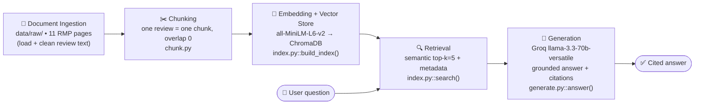

# planning.md — The Unofficial Guide

> Spec-first working document. Written **before** pipeline code. Each decision below is a choice I can
> defend, with the reasoning attached — not a placeholder.

---

## Domain

**Student reviews of UC Berkeley Computer Science / EECS professors and courses.**

Berkeley CS students rely heavily on word-of-mouth to decide *who* to take for a given course — the same
class can be a great experience or a demoralizing one depending entirely on the instructor. That knowledge
is real but scattered across hundreds of individual Rate My Professors reviews, semester by semester, with no
way to ask a plain-language question like *"who should I take for 61A?"* and get a grounded, side-by-side
answer.

**Why it's hard to find through official channels:** The course catalog tells you a course *exists*; it never
tells you a professor "made the final unreasonably hard and refused to release the distribution," or that one
instructor is "the GOAT" while another teaching the same course number is "not prepared for teaching at all."
That signal only lives in informal student reviews, and it's buried — you'd have to read dozens of reviews
across multiple professor pages and mentally aggregate them. This system does that aggregation and cites it.

---

## Documents

11 documents, each a UC Berkeley professor's Rate My Professors page, chosen for **contrast** rather than
volume — beloved, disliked, and divisive instructors across 11 core courses. Full manifest with URLs, ratings,
and honesty caveats: [`data/sources.md`](data/sources.md). Raw text: [`data/raw/`](data/raw/).

| Professor | Courses | Overall | Why it's in the corpus |
|---|---|---|---|
| Peyrin Kao | CS61B, CS161, CS188 | 4.9/5 | top of the rating spectrum |
| Daniel Klein | CS188 | 4.7/5 | beloved, but mostly *old* reviews (2008–2014) — recency contrast |
| Jonathan Shewchuk | CS61B, CS189, CS274 | 4.7/5 | well-liked, multi-course |
| John Wright | CS170 | 4.6/5 | clear positive consensus |
| John DeNero | CS61A, DATA8 | 4.4/5 | mostly positive but with a dissenting "weeder class" review |
| Pamela Fox | CS61A | 4.2/5 | positive but one harsh outlier review |
| James O'Brien | CS184 | 3.9/5 | the "gives good feedback / office hours" case |
| Dan Garcia | CS61A, CS10 | 3.7/5 | **divisive** — same course rated both 1.0 and 4.0 |
| Sarah Chasins | CS164 | 2.7/5 | genuinely split (1.0s and 5.0s) |
| Zachary Pardos | DATA144 | 1.6/5 | strong negative consensus |
| John Canny | CS188, CS182, CS194, CS160 | 1.3/5 | strongest negative consensus |

Single source type (Rate My Professors). Reddit/long-form threads were the intended second source for
variety but are not fetchable in this environment — logged under the stretch/future-work section.

---

## Chunking Strategy

**Decision: one chunk = one review.** No fixed character window. Each raw file is parsed into individual
reviews on review boundaries, and each review becomes exactly one chunk.

**Chunk size:** variable, naturally ~**80–150 tokens** (≈300–600 characters) per review. I am *not* enforcing
a target size — the review *is* the unit. A chunk is the comment text + its advice/tags, **enriched** with a
header line so it is self-describing:

```
Review of Professor Dan Garcia (UC Berkeley, CS61A) — Quality 1.0/5, Difficulty 5.0/5, Grade B+, Jun 2026:
"Professor Garcia is an amazing lecturer and a very kind person. That said, he made the final very hard
this semester without explanation, refused to release distribution data, and shifted the average grade
nearly a full letter grade down."
```

The professor name, course, and ratings are also stored as **structured metadata** on the chunk (for citation
and for the metadata-filtering stretch), but they are *also* baked into the chunk text so a retrieved chunk is
interpretable on its own and so the embedding captures "this is about Garcia / CS61A."

**Overlap: 0.** Overlap exists to stop a single idea from being split across a boundary in long prose. Here
every chunk is already a complete, independent record — a review doesn't continue into the next review.
Adding overlap would *blend two unrelated students' opinions* into one chunk, which is actively harmful for
an opinion corpus. So overlap = 0 is a deliberate consequence of the document structure, not laziness.

**Why this fits these documents (vs. fixed 500-char splitting):**
- The documents are **short reviews (1–3 sentences)**, not long guides. The key fact ("difficulty 5.0, grade
  F", "the worst teacher I've ever had") is concentrated in one review, never spread across paragraphs. The
  natural retrieval unit is therefore the review, not an arbitrary window.
- A fixed 500-char split would **strand a rating from its comment** (cut "Quality 1.0" into a different chunk
  than "stay away") or **merge two contradictory reviews**, destroying the per-opinion granularity that
  comparison questions depend on.

**How I'd know the chunks are wrong (the guiding questions, answered):**
- *Too small* (e.g., splitting comment from its rating/professor): retrieval returns a bare phrase like "stay
  away" or "the GOAT" with no idea which professor or rating it refers to — ungroundable and uncitable.
- *Too large* (e.g., one chunk = a whole professor's page): the embedding becomes an **average** of 5 mixed
  opinions, so a query about "good feedback" matches weakly and the LLM receives positive + negative reviews
  fused together, unable to tell them apart. Comparison and "avoid" questions degrade first.

---

## Retrieval Approach

**Embedding model:** `all-MiniLM-L6-v2` via `sentence-transformers` (384-dim, runs locally, no API key).
Its 256-token input limit is a non-issue here — chunks are ~80–150 tokens, so nothing gets truncated. It's
fast and well-matched to short English opinion text.

**top-k = 5** (default). Reasoning for this corpus (~55 chunks total):
- Single-professor questions ("Is Canny worth it?") need ~3–5 reviews to establish consensus → k=5 covers it.
- **Comparison questions are the stress case.** "Who should I take for CS61A?" needs reviews from *multiple*
  professors (DeNero, Garcia, Fox). k too low → the answer sees only one professor and can't compare. So if
  evaluation shows comparison questions starved, **k is the first knob I'll raise (to ~8)** — documented in
  Milestone 6 rather than guessed now.
- k too high (e.g., 20 of 55 chunks) → pulls in off-topic professors/courses and dilutes the context the LLM
  must reason over, increasing the chance it cites an irrelevant review.

**Why semantic search works even without shared words:** the embedding maps *meaning* to a vector, so
"is this class hard?" lands near "difficulty 5.0," "weeder class," and "made the final unreasonably hard"
even though none of those share the word "hard." Keyword search would miss all three.

**If cost weren't a constraint (production tradeoffs I'd weigh):**
- **Accuracy on opinion/slang text:** I'd benchmark a larger model (`bge-large-en`, `e5-large`, or OpenAI
  `text-embedding-3-large`) against MiniLM on *my own eval set* — only switch if it measurably improves
  retrieval, since bigger ≠ automatically better on short slangy reviews.
- **Context length:** irrelevant here (tiny chunks); would matter only if I moved to long-form guides.
- **Multilingual:** not needed (reviews are English); if the corpus grew to include non-English posts I'd use
  a multilingual model (`paraphrase-multilingual-MiniLM`, Cohere multilingual).
- **Latency & privacy:** local MiniLM wins on both — no per-query API cost, no round-trip, and student review
  data never leaves the machine. For a real deployment that privacy point would weigh heavily.

---

## Evaluation Plan

5 test questions, each with a **specific, checkable** expected answer grounded in the corpus. (Grading rubric
in Milestone 6: retrieval accurate / partial / inaccurate, and response accurate / partial / inaccurate.)

1. **"I'm choosing a CS61A professor — what do students say about Dan Garcia?"** *(divisive — planted failure case)*
   **Expected:** Reviews are *polarized*. Praise: amazing/entertaining lecturer, "great teaching style,"
   "clear lectures, fair exams" (Quality 4.0). Criticism: made the final unreasonably hard without
   explanation, refused to release the grade distribution, shifted the average down ~a letter grade, raised
   fail rates (Quality 1.0). **A correct answer must surface BOTH sides.** Picking one polarity = failure.

2. **"Are John Canny's classes worth taking?"** *(strong negative consensus)*
   **Expected:** Strongly negative — overall 1.3/5, 20% would take again. Specifics: "not prepared for
   teaching at all," "the worst teacher I have ever had," "most unclear professor," students recommend
   watching prior-semester videos instead. Correct = clearly negative + ≥1 specific complaint.

3. **"Which CS professor is known for giving good feedback and being patient in office hours?"** *(sparse-signal retrieval test)*
   **Expected:** **James O'Brien** (CS184) — tagged "Gives good feedback" and "Caring"; a review says if you
   go to office hours "he'll work with you until you get it. Very patient." The phrase appears in essentially
   *one* chunk, so this tests whether retrieval can find a needle rather than return generically-positive reviews.

4. **"Is CS61B hard, and who's a good professor for it?"** *(course difficulty + instructor)*
   **Expected:** CS61B rates difficult (~3–4/5) but two well-liked instructors: **Peyrin Kao** (4.9/5, "one
   of the best CS lecturers," "super easy to follow") and **Jonathan Shewchuk** ("good style and tempo, right
   pace"). Correct = states it's challenging AND names Kao and/or Shewchuk positively.

5. **"Which Berkeley CS / data science professors should I avoid based on reviews?"** *(synthesis across the negative cluster)*
   **Expected:** **John Canny** (1.3/5, "worst teacher"), **Zachary Pardos / DATA144** (1.6/5, "disorganized,"
   "you take it to get an A, not to learn anything"), and arguably **Sarah Chasins / CS164** (2.7/5, "super
   poorly run class"). Correct = surfaces Canny and Pardos at minimum. Failure mode: over-generalizing from a
   ~5-review sample, or naming a professor not actually in the negative set.

---

## Anticipated Challenges

1. **Contradictory reviews → false consensus.** Garcia, Chasins, and Fox each contain opposite-polarity
   reviews. The generator may retrieve a few and present a one-sided answer ("Garcia is great!") that hides
   the disagreement. *Mitigation:* retrieve enough chunks to capture both poles (top-k tuning) and prompt the
   LLM to explicitly report disagreement when reviews conflict.

2. **Sparse-signal queries miss the needle.** Tag-like questions ("gives good feedback") match a single chunk
   (O'Brien). Semantic search may rank several *generically positive* reviews above the one truly relevant
   review, returning a fluent but wrong professor. *Mitigation:* candidate for the hybrid (BM25 + semantic)
   stretch, since exact tokens like "feedback" and course codes help here.

3. **Citation/attribution mixing.** Because chunks from many professors look similar ("amazing lectures"),
   the LLM could attach a quote to the wrong professor. *Mitigation:* every chunk carries professor+course in
   both its text and metadata, and the prompt requires per-claim source attribution.

4. **Small, sampled corpus → overconfidence.** Each professor has ~5 sampled reviews; absence of a professor
   isn't evidence they're bad. The system could over-generalize. *Mitigation:* prompt the model to ground
   claims strictly in retrieved text and to say when it doesn't have enough information.

---

## AI Tool Plan

Where I'll use an AI tool (Claude Code) to implement, the **input** is the named planning.md section + the
specific instruction requirement, and the **output** is a named function/file I can read and debug.

| Pipeline stage | Input I give the AI | Expected output |
|---|---|---|
| **Chunking** | This *Chunking Strategy* section + one sample `data/raw/rmp_*.md` file | `chunk.py::load_and_chunk()` — parses each raw file into per-review chunks with enriched text + a metadata dict `{professor, course, quality, difficulty, grade, date, source_url}`. No fixed-size splitting. |
| **Embedding + vector store** | *Retrieval Approach* section + the chunk metadata schema | `index.py::build_index()` — embeds chunks with `all-MiniLM-L6-v2` and writes to a persistent ChromaDB collection with metadata. |
| **Retrieval** | top-k decision + metadata schema | `index.py::search(query, k=5)` — returns top-k chunks with text, metadata, and similarity score. |
| **Grounded generation** | The grounding + citation requirements (Features 4) + the contradiction/attribution challenges above | `generate.py::answer(query)` — builds a context-only prompt for Groq `llama-3.3-70b-versatile`, refuses to use outside knowledge, and returns an answer with per-claim source attribution. |
| **Query interface** | Feature 5 (must be demoable without explanation) | A CLI (`ask.py`) and/or a notebook cell that takes a question and prints the answer + sources. |
| **Evaluation** | The 5 questions above + the grading rubric | `evaluate.py` — runs each question, logs the retrieved chunks, and emits a results table for the Milestone 6 report. |

I am **not** asking the AI to invent the strategy — the decisions (review-per-chunk, overlap 0, top-k=5,
MiniLM, the 5 questions) are made here; the AI implements them so I can read and debug each function.

---

## Architecture



Plain-text fallback (same five stages, same tools):

```
[Ingestion: data/raw, 11 RMP pages]
        -> [Chunking: 1 review = 1 chunk, overlap 0  | chunk.py]
        -> [Embed + Store: all-MiniLM-L6-v2 -> ChromaDB | index.py]
        -> [Retrieve: semantic top-k=5 + metadata | index.search()]
        -> [Generate: Groq llama-3.3-70b, grounded + cited | generate.py]
   user question -----------------^                          |
                                                             v
                                                   cited answer to user
```

---

## Stretch feature log
> Update this section *before* starting any stretch feature.

- [ ] **Hybrid search (semantic + BM25)** — strong candidate; directly targets Challenge 2 (course codes like
  "CS61A" and exact tokens like "feedback" are where keyword search complements embeddings).
- [ ] **Chunking comparison** (review-per-chunk vs. fixed 500-char window) on the 5-question eval set.
- [ ] **Metadata filtering** (by course, rating, or recency) — metadata is already structured per chunk.
- [ ] **Conversational memory** (multi-turn follow-ups).
- [ ] **Future source expansion:** add long-form r/berkeley / forum threads to contrast short reviews with
  long-form text (Reddit was not fetchable in the build environment; revisit).
